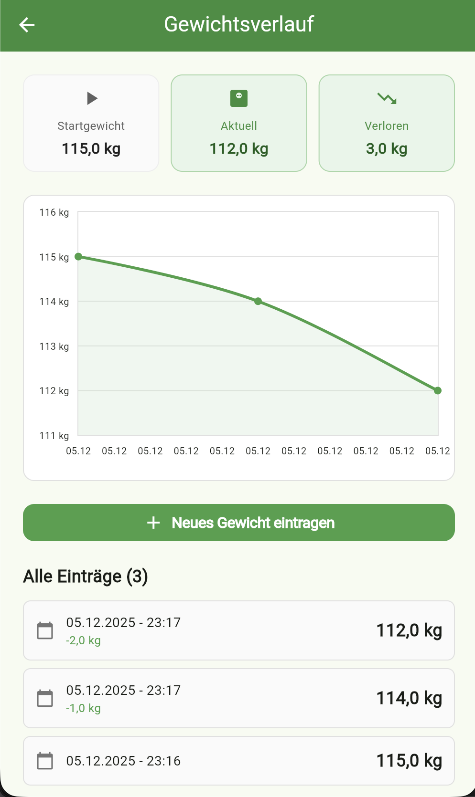
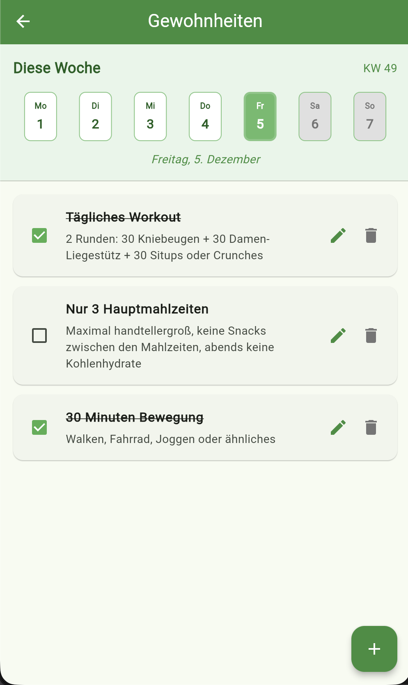

# Einfach Appnehmen 🏋️

Eine Progressive Web App (PWA) zur Unterstützung beim Abnehmen – mit lokaler Datenspeicherung, Gewichtsverfolgung und Heißhunger-Notfallhilfe.

## 📱 Über die App

**Appnehmen** ist eine minimalistische PWA, die dir mit einfachen aber wirksamen Werkzeugen beim Abnehmen hilft:

### Screenshots

<p align="center">
  
  
  
</p>

### Features

- 📊 **Gewichtsverfolgung**: Verfolge deinen Fortschritt mit grafischer Auswertung und farbiger Trendlinie
- 🎯 **Zielgewicht anpassen**: Ändere dein Zielgewicht jederzeit, ohne Daten zu verlieren
- ✅ **Gewohnheiten-Tracker**: Verfolge tägliche Gewohnheiten mit Wochen-Übersicht und farbigem Fortschritt
- 🎉 **Konfetti-Feiern**: Kleine Belohnungen bei Erfolgen
- 💡 **Tägliche Tipps**: Hilfreiche Tipps zum Abnehmen (max. 1 pro Tag)
- 💪 **Dein Warum**: Bleib motiviert durch dein persönliches "Warum"
- 🚨 **Heißhunger-Notfall**: Strukturierte Hilfe bei akuten Heißhunger-Momenten
- 🔔 **Was ist neu?**: Übersicht aller Änderungen und neuen Funktionen
- 🔒 **100% Privat**: Alle Daten bleiben lokal auf deinem Gerät

### Entstehungsgeschichte

Ich habe selbst 45 Kilo abgenommen und teile mit dieser App die kleinen aber wirksamen Alltagswerkzeuge, die mir dabei geholfen haben. Dies ist ein Freizeitprojekt ohne kommerzielles Interesse.

## 🚀 Installation

### Als PWA auf dem Smartphone

1. Öffne die App im Browser: **[https://oliverbyte.github.io/appnehmen](https://oliverbyte.github.io/appnehmen)**

2. **Auf iOS (iPhone/iPad)**:
   - Tippe auf das Teilen-Symbol (□↑)
   - Wähle "Zum Home-Bildschirm"
   - Bestätige mit "Hinzufügen"

3. **Auf Android**:
   - Tippe auf die drei Punkte (⋮) im Browser
   - Wähle "App installieren" oder "Zum Startbildschirm hinzufügen"
   - Bestätige die Installation

4. Die App erscheint nun als Icon auf deinem Startbildschirm und verhält sich wie eine native App!

### Als PWA auf dem Desktop

- **Chrome/Edge**: Klicke auf das ⊕ Symbol in der Adresszeile
- **Safari**: Datei → Zum Dock hinzufügen

## 🛠️ Technologie

- **Framework**: Flutter Web
- **Storage**: Lokaler Browser-Speicher (shared_preferences)
- **Charts**: fl_chart für Gewichtsverlauf-Visualisierung
- **Deployment**: GitHub Pages

## ✨ Features

### Onboarding
- Erstmalige Erfassung von Name, aktuellem Gewicht, Wunschgewicht und persönlicher Motivation

### Startseite
- Persönliche Begrüßung mit verbleibenden Kilos
- Prominent platziertes "Dein Warum" für tägliche Motivation
- Drei Hauptbereiche:
  - **Mein Gewicht**: Aktuelle Übersicht und neuen Eintrag hinzufügen
  - **Meine Gewohnheiten**: Direkter Zugriff auf den Gewohnheiten-Tracker
  - **Heißhunger-Notfall**: Schneller Zugriff auf die 2-Schritte-Hilfe

### Gewichtsverfolgung
- Eingabe neuer Gewichtsmessungen (mit deutscher Komma-Unterstützung: 75,5 kg)
- Button zum Eintragen direkt im Gewichtsverlauf-Tab
- Grafische Darstellung des Verlaufs mit Zielgewicht-Linie
- Deutlich sichtbare Trendlinie: Grau bei neutralem Verlauf, Rot bei Gewichtszunahme, Grün bei Gewichtsabnahme
- Statistiken: Startgewicht, aktuelles Gewicht, verlorene Kilos
- Chronologische Liste aller Einträge
- Zielgewicht jederzeit anpassbar (Klick auf Ziel-Anzeige)
- Konfetti-Animation bei Gewichtsverlust

### Gewohnheiten-Tracker
- Tägliches Tracking von gesunden Gewohnheiten
- 3 Standard-Gewohnheiten voreingestellt:
  - Tägliches Workout (2 Runden à 30x Übungen)
  - Nur 3 Hauptmahlzeiten (maximal handtellergroß, keine Snacks, abends keine Kohlenhydrate)
  - 30 Minuten Bewegung (Walken, Fahrrad, Joggen)
- Eigene Gewohnheiten hinzufügen und editieren
- Wöchentliche Übersicht mit Fortschritts-Farbverlauf (je grüner, desto besser)
- Tag-Auswahl mit visueller Hervorhebung des ausgewählten Tags
- Simple Checkbox-Ansicht für den aktuellen Tag
- Konfetti-Animation bei abgeschlossener Gewohnheit

### Heißhunger-Notfall
- **Schritt 1**: Trinke 2 Gläser Wasser
- **Schritt 2**: Warte 10 Minuten (mit Timer)
- Strukturierte Hilfe für kritische Momente

### Tägliche Tipps
- Maximal ein Tipp pro Tag
- Hilfreiche Ratschläge zum Abnehmen
- Automatische Anzeige beim Betreten der Startseite

### Was ist neu?
- Übersicht aller Änderungen und neuen Funktionen
- Gruppiert nach Monat
- Nutzerfreundliche Beschreibungen

### Burger-Menü
- Navigation zu allen Hauptfunktionen
- Gewichtsverlauf, Gewohnheiten, Heißhunger-Notfall
- Hilfe-Seite mit Installationsanleitung
- Info-Seite mit Hintergrundinfos zur App
- Was ist neu? mit allen Änderungen

## 🔐 Datenschutz

**Alle Daten werden ausschließlich lokal auf deinem Gerät gespeichert.**

- Keine Server-Kommunikation
- Keine Cloud-Synchronisation
- Keine Weitergabe an Dritte
- Vollständige Kontrolle über deine Daten

## 💻 Entwicklung

### Voraussetzungen

```bash
# Flutter installieren (stable channel)
flutter channel stable
flutter upgrade

```bash
# Repository klonen
git clone https://github.com/oliverbyte/appnehmen.git
cd appnehmen

# Dependencies installieren
flutter pub get
```

### Lokal ausführen

```bash
# Im Chrome Browser
flutter run -d chrome

# Als Web-Server (für Netzwerk-Zugriff, z.B. vom Smartphone)
flutter run -d web-server --web-port=8080 --web-hostname=0.0.0.0
```

### Bauen

```bash
# Production Build
flutter build web --release

# Output in build/web/
```

## 📧 Feedback & Kontakt

Ich freue mich über Feedback und Anregungen:

**E-Mail**: [info@oliverbyte.de](mailto:info@oliverbyte.de)

*(Freizeitprojekt, kein Support)*

## 📄 Lizenz

MIT License - siehe [LICENSE](LICENSE) Datei für Details.

Dieses Projekt ist Open Source und kann frei verwendet, modifiziert und weiterverbreitet werden.

---

Made with ❤️ by Oliver Byte | MIT License
